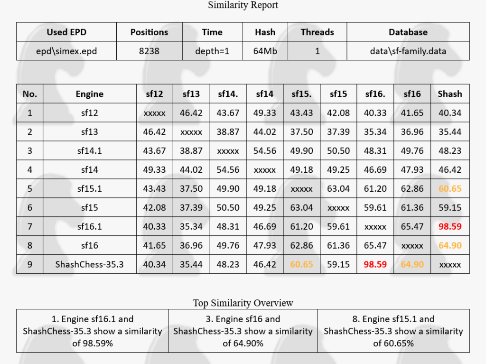

The WCCC organizers allowed a clone, ShashChess, to participate as a proxy for Stockfish (that didn’t enter), which we find disrespectful. Consequently, we are withdrawing from the competition.

<!--more-->

#### Our concerns in more detail

When it was announced that this year's WCCC would be the final one, we were eager to take part and started making preparations. As part of that, we encouraged the Stockfish core developers to join as well, and although they decided not to compete, we completely understand and support their choice.

When the participant list came out, we were surprised to see ShashChess included. Given the strict originality requirements for the WCCC, which have sparked significant [controversies](https://www.chessprogramming.org/Rybka_Controversy) in the past, this was very unexpected.

ShashChess appears to follow a common pattern where individuals make arbitrary modifications to Stockfish and claim non-existent improvements, heavily exaggerating the value of their contributions. This misleads others into giving credit for any achievements to the wrong people.

Here are our main concerns:

1. **Superficial modifications**: Our analysis of ShashChess shows that its most significant changes in the chess playing code are modifications of work originating from Crystal, another Stockfish derivative. These changes are minor and do not represent any meaningful advancement in chess engine development.
2. **Optional features**: New features highlighted in ShashChess are optional and most likely hurt the performance, and as such cannot be guaranteed to be used during the competition. This leads to the concerning possibility that, by optimizing for their strongest performance, ShashChess could end up being configured to be essentially Stockfish, without the organizers—or the community—being able to detect it.
3. **Similarity analysis**: Simex, a similarity analysis tool originally developed by the Komodo authors, shows that ShashChess's evaluation function is virtually indistinguishable from Stockfish's. Even minor releases of Stockfish exhibit much more significant differences in Simex.

We shared these concerns with the ICGA along with our decision to withdraw. To our disappointment, their responses seemed to rely heavily on ShashChess's self-assessment. They expressed the opinion that ShashChess was "significantly different" from Stockfish, without conducting an independent evaluation. Our concerns were forwarded to the ShashChess authors, and their response was simply passed back to us, which was not the investigation we had anticipated.

This is our final reply:

> We are unsure why you forwarded us the responses from ShashChess. It is the responsibility of the WCCC organizers to determine if an engine complies with the rules and verify the truthfulness of the information provided by its developers.  
> &nbsp;  
> In our perspective, the WCCC did an unsatisfactory job in evaluating ShashChess's compliance with the participant rules. This undermines the competition's integrity. Therefore, we are not reconsidering our decision to withdraw from the competition.

On a positive note, the extended preparation we did for WCCC will not be wasted. We're looking forward to sharing some insights into our strategies and tools we’ve developed for our entry.

